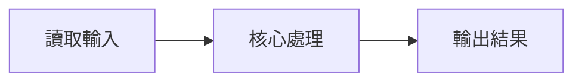
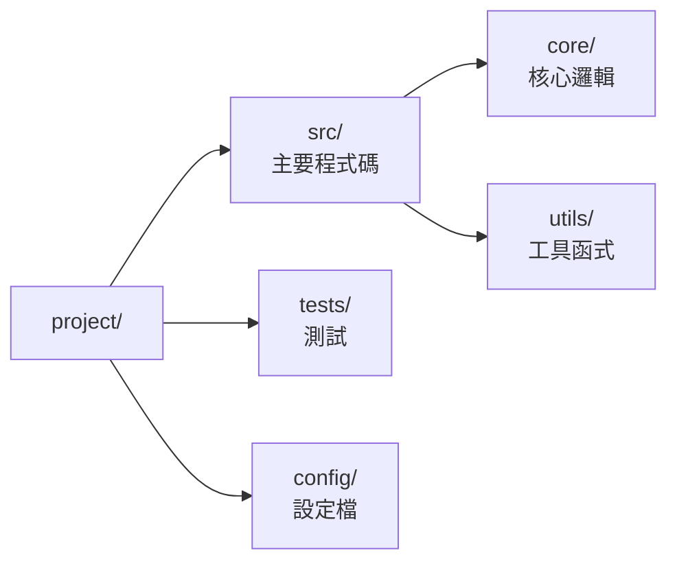

# Learn TW Skill

Create an engaging, personalized learning document that explains a project in plain language. Two deliverables, one source:

- **`FOR[username].md`** — the primary deliverable; always ships. `[username]` is the user's name.
- **`FOR[username].html`** — the 好讀版, generated **from the `.md`** by the optional `markdown-to-html` skill (see 〈Generating the HTML 好讀版〉). The `.md` is the single source of truth — the HTML is never hand-written. Skill not installed → skip silently; the `.md` alone is the deliverable.

## Workflow

1. **先綁定讀者與目標**（見〈讀者與目標〉）——它決定後面每一步深挖哪些子系統。
2. Explore codebase structure (`ls`, file patterns).
3. Read key files (entry points, configs, core modules).
4. Identify architecture patterns and tech decisions.
5. Note documented bugs/issues in git history and comments.
6. Write `FOR[username].md` in Taiwan Traditional Chinese, following every rule in the
   writing-rule sections below (〈Language Requirements〉 through 〈Document template〉).
   Make the first line (H1) a **descriptive document title** — project name + 學習筆記
   (e.g. `# fcs-forensics 學習筆記`), NOT the filename; it becomes the HTML page title.
   Done when: all 7 sections present, every「為什麼」traceable per〈證據紀律〉, every
   diagram follows〈Diagrams〉.
7. **Save into a timestamped topic folder** — never loose in the project root.
   Path: `<主題>-<時間戳>/FOR[username].md`.
   - `<主題>` — filesystem-safe slug of the subject, usually the repo name: lowercase, spaces → `-`.
   - `<時間戳>` — **read the real clock, never guess it**: `date +%Y%m%d-%H%M` (e.g. `20260707-1432`).
   - The Write step creates the folder (no `mkdir`). Each run is a self-contained snapshot;
     re-running never overwrites an earlier one (folders accumulate — that is the point).
8. Generate the HTML 好讀版 per 〈Generating the HTML 好讀版〉.

## The 7 sections

1. **專案概述 (Project Overview)** — what the project does, who it's for, the problem it solves
2. **技術架構 (Technical Architecture)** — system design, data flow, key components and how they connect
3. **程式碼結構 (Codebase Structure)** — directory layout, important files, where to find things
4. **技術選型 (Technology Stack)** — what's used and why it beat the alternatives
5. **設計決策 (Design Decisions)** — the "why" behind architectural choices, trade-offs considered
6. **學習心得 (Lessons Learned)** — bugs encountered, pitfalls to avoid, best practices discovered
7. **工程師思維 (How Good Engineers Think)** — patterns, mental models, debugging approaches used

## 讀者與目標（先綁定，再下筆）

一份只把*檔名*個人化的文件，對所有讀者都長一樣，往往太抽象。下筆前先確立
**這份文件為誰而寫、讀完他要能做什麼**：

- 使用者沒講就**問**（或從他的指令合理推斷）：誰要讀？讀完要能做什麼——
  onboarding？改某個子系統？評估技術選型？交接？
- 把它寫成**開場框定**：放在 H1 標題下、`專案概述` 之前，用一句引言（`>`）
  或一行粗體交代清楚。**不要用 H2**，以免占用七大章節的編號。
- 讓它**真的影響內容**，而不只是裝飾：目標是「改 FCS parser」→`程式碼結構`
  與`設計決策`就聚焦那個子系統，而非均勻導覽；讀者是資深工程師→多談 trade-off，
  是新手→先給定位與全貌。同一個專案，給不同讀者就是兩份不同的文件。

## Language Requirements

**Output MUST be in Taiwan Traditional Chinese (繁體中文)**, using Taiwan local terminology:

| Taiwan Term (Use) | Mainland Term (Avoid) |
|-------------------|----------------------|
| 程式碼 | 代碼 |
| 資料庫 | 數據庫 |
| 資料 | 數據 |
| 軟體 | 軟件 |
| 硬體 | 硬件 |
| 網路 | 網絡 |
| 伺服器 | 服務器 |
| 記憶體 | 內存 |
| 物件 | 對象 |
| 變數 | 變量 |
| 迴圈 | 循環 |
| 陣列 | 數組 |
| 函式 | 函數 |
| 檔案 | 文件 |
| 視窗 | 窗口 |
| 滑鼠 | 鼠標 |
| 列印 | 打印 |

## Writing Style

- **Engaging, not boring** — write like explaining to a curious friend, not a textbook
- **Use analogies** — compare complex concepts to everyday things
- **Include anecdotes** — "We tried X, it broke because Y, so we did Z"
- **Be specific** — real file names, real error messages, real solutions
- **Show the journey** — include the mistakes, not just the final answer
- **論斷要有出處** — 見〈證據紀律〉
- **Highlight key insights** — for an important takeaway, write a `★ Insight ─────` block:
  a line `★ Insight` followed by box-drawing rules (`─`), then the points, then a closing
  `─` rule line. The 好讀版 renders it as a styled「★ 重點」callout box.

## 證據紀律（論斷要有出處）

把「絕不憑空臆測」當鐵則——這是 learn-tw 最容易出錯的地方（自信地編造設計理由）。
`設計決策`與`學習心得`裡每個「為什麼」都要能追溯到**真實證據**：

- 連回**穩定名稱**——檔名、`Class.method`、路由、commit、git log、程式碼註解——
  **不要用 `file:line`**（位置會失效，名稱會跟著程式碼走）。
- 找不到佐證的因果或歷史，就**標明**「（推測，未在程式碼／git 找到佐證）」，
  不要把猜測寫成事實。一句沒有來源的「我們當初選 X 是因為 Y」比留白更糟。

## 自我檢核（retrieval practice）

被動讀完不等於學會；從記憶**主動提取**才建立長期記憶。每個主要章節結尾可**選**放
一題「自我檢核」，讓讀者先答再展開對照。寫成 `<details>` 折疊區塊：

```md
<details class="self-check" markdown="1">
<summary>自我檢核：資料從讀取到報告，經過哪幾層？</summary>

> 先自己想，再展開對照。

讀取 FCS → 解析 TEXT/DATA → 計算統計量 → 產生報告，共四層。

</details>
```

格式要點（**務必照做，否則算繪會壞**）：

1. `<summary>` 後**空一行**，內層答案前後也**各空一行**——否則 GitHub/GitLab 不會把
   答案當 Markdown 算繪。
2. `class="self-check"` 與 `markdown="1"` 兩者都要：前者觸發編輯風樣式，後者讓內層
   答案被當 Markdown 解析（而非一坨原始 HTML）。
3. 一節最多一題，問「能否重述／推導」而非背名詞；難度適中即可。
4. 算繪行為：好讀版是可折疊卡片（收合顯示「？」、展開顯示「✓」，**列印時自動
   全部展開**）；`.md` 在 GitHub/GitLab 上是原生折疊。

## 附錄：詞彙表（Glossary，選用）

當專案有自己的術語時，在文件**最後**加一個詞彙表，並**全文一律遵守**——它是這份
文件的權威用語，順便降低不熟領域讀者的門檻。這是把上方〈Language Requirements〉的
用詞表，從*中文用語*延伸到*專案領域*。格式示意：

| 詞彙 | 定義（一兩句，講它*是什麼*） | 避免混用 |
|------|------------------------------|----------|
| Gating | 在散點圖／直方圖上圈選目標細胞族群的操作 | 篩選、過濾 |
| Keyring | 作業系統的金鑰串／憑證保管庫（如 macOS Keychain） | 環境變數、設定檔 |

規則：只收**真正需要釐清**的詞；同義詞挑一個當標準、其餘列入「避免混用」；定義裡
也優先使用詞彙表自己的詞。沒有領域術語的專案就**不必**加這個附錄。

## Diagrams: use Mermaid

Draw diagrams as ` ```mermaid ` fenced code blocks with **Chinese labels written
directly** — Mermaid renders vector diagrams, so CJK alignment is never a problem.
The 好讀版 renders them with mermaid.js (loaded from a CDN at view time; the diagram
text is rendered locally and never sent anywhere — safe for internal architecture);
the `.md` renders natively on GitHub/GitLab, and in a bare terminal the Mermaid
source is still legible.

1. `flowchart` for pipelines/architecture, `sequenceDiagram` for interactions.
   Keep labels short; Chinese is fine.

   ```mermaid
   flowchart LR
       A[讀取 FCS] --> B[解析 TEXT/DATA]
       B --> C[計算統計量]
       C --> D[產生報告]
   ```
2. **Directory / file trees** → a Mermaid `flowchart LR` (parent → child, so it reads
   like an indented tree). Put a node's name and its description on separate lines
   with `<br/>`:

   ```mermaid
   flowchart LR
       r["project/"] --> s["src/<br/>主要程式碼"]
       s --> c["core/<br/>核心邏輯"]
       r --> t["tests/<br/>測試"]
   ```
3. **CJK never goes inside an ASCII / box-drawing diagram.** CJK glyphs are
   **double-width**, so a frame built from `┌ ─ ┐ │ └ ┘` / `+--+` splits open the
   moment a label is Chinese — in every renderer and font. Anything with a real shape
   (boxes, layers, quadrants, trees) → Mermaid or a Markdown table. A plain ASCII
   block is fine only while its content stays pure ASCII (`a -> b -> c`, code
   snippets, ASCII-labelled charts).

## Generating the HTML 好讀版

Markdown → HTML is a pure deterministic transform, delegated to the optional
`markdown-to-html` skill — learn-tw bundles no converter, and the HTML is never
hand-written.

Resolve `{MARKDOWN_TO_HTML}` to the first of these where `scripts/md_to_html.py`
exists: `.claude/skills/markdown-to-html/` (project), then
`~/.claude/skills/markdown-to-html/` (user). No match → the skill is not installed;
skip this step silently and ship only the `.md`.

```bash
# --project resolves the converter's deps from that skill's own pyproject.toml (uv, not pip)
uv run --project {MARKDOWN_TO_HTML} python {MARKDOWN_TO_HTML}/scripts/md_to_html.py <主題>-<時間戳>/FOR[username].md
```

The converter writes `FOR[username].html` as a sibling in the same folder (no output
path needed) and prints the **absolute** paths of both files plus a `file://` link —
relay those to the user verbatim so they can open the `.html` directly.

The output is a single self-contained editorial page tuned for long-form Chinese
reading — 書卷感 typography, a Chinese font switcher, a scroll-spy TOC, a light/dark
theme, Mermaid rendered as vectors, a print stylesheet; web fonts and Mermaid load
from a CDN at view time and degrade gracefully offline. The authoritative feature
list lives in the `markdown-to-html` skill.

## Document template

```markdown
# [專案名稱] 學習筆記

## 專案概述

[用一段話說明這個專案做什麼、給誰用、解決什麼問題]

---

## 技術架構

[系統設計、資料流、關鍵元件如何串接]



想像這個系統像是...（比喻）

---

## 程式碼結構



重要檔案：
- `src/main.ts` - 進入點
- `src/core/engine.ts` - 核心引擎

---

## 技術選型

| 技術 | 用途 | 為何選它 |
|------|------|----------|
| [技術名] | [用途] | [原因] |

---

## 設計決策

### 決策 1：[標題]

**問題：** [遇到什麼問題]

**選項：**
- A：[方案 A]
- B：[方案 B]

**決定：** 選 A，因為...

---

## 學習心得

### 踩過的坑

**問題：** [錯誤訊息或現象]
**原因：** [為什麼會這樣]
**解法：** [怎麼修的]
**學到：** [以後要注意什麼]

### 最佳實踐

- [實踐 1]
- [實踐 2]

---

## 工程師思維

[這個專案展現的設計模式、除錯方法、思考方式]
```
