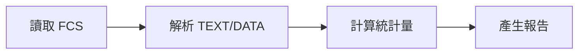
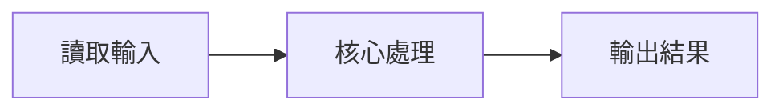
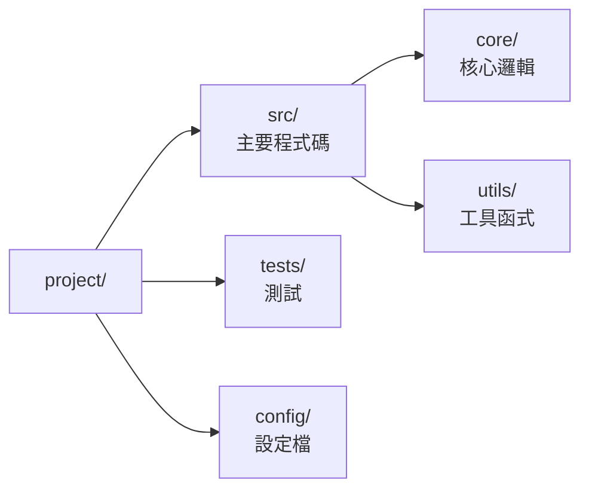

# Learn TW Skill

Create engaging, personalized learning documents that explain projects in plain language.

Every run produces two files together:

- **`FOR[yourname].md`** — plain Markdown; easy to version-control, diff, and read in a terminal.
- **`FOR[yourname].html`** — the readable version, an editorial "書卷感" layout tuned for long-form Chinese (warm-paper editorial design, a 6-font Chinese font switcher, a scroll-spy table of contents, a reading-progress bar, auto-numbered sections, a light/dark theme toggle, rendered Mermaid diagrams, printable). It is generated from the `.md` by `scripts/md_to_html.py`, so the content has a single source and the HTML is never hand-written.

## Language Requirements

**Output MUST be in Taiwan Traditional Chinese (繁體中文)**, using Taiwan local terminology:

| Taiwan Term (Use) | Mainland Term (Avoid) |
|-------------------|----------------------|
| 程式碼 | 代碼 |
| 資料庫 | 數據庫 |
| 資料 | 數據 |
| 軟體 | 軟件 |
| 硬體 | 硬件 |
| 網路 | 網絡 |
| 伺服器 | 服務器 |
| 記憶體 | 內存 |
| 物件 | 對象 |
| 變數 | 變量 |
| 迴圈 | 循環 |
| 陣列 | 數組 |
| 函式 | 函數 |
| 檔案 | 文件 |
| 視窗 | 窗口 |
| 滑鼠 | 鼠標 |
| 列印 | 打印 |

## Quick Start

```
/learn-tw
```

This generates **both** `FOR[username].md` and `FOR[username].html` in the project root.

## What Gets Generated

### FOR[yourname].md / FOR[yourname].html Contents

Both files carry identical content — only the format differs (the `.html` is generated from the `.md`):

1. **專案概述 (Project Overview)** - What the project does, who it's for, the problem it solves
2. **技術架構 (Technical Architecture)** - System design, data flow, key components and how they connect
3. **程式碼結構 (Codebase Structure)** - Directory layout, important files, where to find things
4. **技術選型 (Technology Stack)** - What's used and why we chose it over alternatives
5. **設計決策 (Design Decisions)** - The "why" behind architectural choices, trade-offs considered
6. **學習心得 (Lessons Learned)** - Bugs encountered, pitfalls to avoid, best practices discovered
7. **工程師思維 (How Good Engineers Think)** - Patterns, mental models, debugging approaches used

## Writing Style Guidelines

- **Engaging, not boring** - Write like explaining to a curious friend, not a textbook
- **Use analogies** - Compare complex concepts to everyday things
- **Include anecdotes** - "We tried X, it broke because Y, so we did Z"
- **Be specific** - Real file names, real error messages, real solutions
- **論斷要有出處** - 見〈論斷要有出處（證據紀律）〉：每個「為什麼」都要連回真實
  程式碼／git 證據，找不到佐證就標「推測」，不要把猜測寫成事實
- **Show the journey** - Include the mistakes, not just the final answer
- **Highlight key insights** - For an important takeaway, write a `★ Insight ─────` block:
  a line `★ Insight` followed by box-drawing rules (`─`), then the points, then a closing
  `─` rule line. The readable HTML renders it as a styled "★ 重點" callout box.

## 讀者與目標（先綁定，再下筆）

一份只把*檔名*個人化的文件，對所有讀者都長一樣，往往太抽象。下筆前先確立
**這份文件為誰而寫、讀完他要能做什麼**：

- 使用者沒講就**問**（或從他的指令合理推斷）：誰要讀？讀完要能做什麼——
  onboarding？改某個子系統？評估技術選型？交接？
- 把它寫成**開場框定**：放在 H1 標題下、`專案概述` 之前，用一句引言（`>`）
  或一行粗體交代清楚。**不要用 H2**，以免占用七大章節的編號。
- 讓它**真的影響內容**，而不只是裝飾：目標是「改 FCS parser」→`程式碼結構`
  與`設計決策`就聚焦那個子系統，而非均勻導覽；讀者是資深工程師→多談 trade-off，
  是新手→先給定位與全貌。同一個專案，給不同讀者就是兩份不同的文件。

## 論斷要有出處（證據紀律）

把「絕不憑空臆測」當鐵則——這是 learn-tw 最容易出錯的地方（自信地編造設計理由）。
`設計決策`與`學習心得`裡每個「為什麼」都要能追溯到**真實證據**：

- 連回**穩定名稱**——檔名、`Class.method`、路由、commit、git log、程式碼註解——
  **不要用 `file:line`**（位置會失效，名稱會跟著程式碼走）。
- 找不到佐證的因果或歷史，就**標明**「（推測，未在程式碼／git 找到佐證）」，
  不要把猜測寫成事實。一句沒有來源的「我們當初選 X 是因為 Y」比留白更糟。

## 自我檢核（retrieval practice）

被動讀完不等於學會；從記憶**主動提取**才建立長期記憶。每個主要章節結尾可**選**放
一題「自我檢核」，讓讀者先答再展開對照。寫成 `<details>` 折疊區塊：

```md
<details class="self-check" markdown="1">
<summary>自我檢核：資料從讀取到報告，經過哪幾層？</summary>

> 先自己想，再展開對照。

讀取 FCS → 解析 TEXT/DATA → 計算統計量 → 產生報告，共四層。

</details>
```

格式要點（**務必照做，否則算繪會壞**）：

1. `<summary>` 後**空一行**，內層答案前後也**各空一行**——否則 GitHub/GitLab 不會把
   答案當 Markdown 算繪。
2. `class="self-check"` 與 `markdown="1"` 兩者都要：前者觸發編輯風樣式，後者讓內層
   答案被當 Markdown 解析（而非一坨原始 HTML）。
3. 一節最多一題，問「能否重述／推導」而非背名詞；難度適中即可。
4. 算繪行為：HTML 好讀版是可折疊卡片（收合顯示「？」、展開顯示「✓」，**列印時自動
   全部展開**）；`.md` 在 GitHub/GitLab 上是原生折疊。

## 附錄：詞彙表（Glossary，選用）

當專案有自己的術語時，在文件**最後**加一個詞彙表，並**全文一律遵守**——它是這份
文件的權威用語，順便降低不熟領域讀者的門檻。這是把上方〈Language Requirements〉的
用詞表，從*中文用語*延伸到*專案領域*。格式示意：

| 詞彙 | 定義（一兩句，講它*是什麼*） | 避免混用 |
|------|------------------------------|----------|
| Gating | 在散點圖／直方圖上圈選目標細胞族群的操作 | 篩選、過濾 |
| Keyring | 作業系統的金鑰串／憑證保管庫（如 macOS Keychain） | 環境變數、設定檔 |

規則：只收**真正需要釐清**的詞；同義詞挑一個當標準、其餘列入「避免混用」；定義裡
也優先使用詞彙表自己的詞。沒有領域術語的專案就**不必**加這個附錄。

## Diagrams: use Mermaid

Draw diagrams as ` ```mermaid ` fenced code blocks, with **Chinese labels written
directly**. Mermaid renders them as proper vector diagrams, so there is no
alignment problem — the old "English labels + Chinese legend" ASCII workaround is
no longer needed.



How each output renders it:

- **`FOR[name].html`** renders the diagram with mermaid.js. The library is loaded
  from a CDN at view time; the diagram text is rendered locally in the browser and
  never sent anywhere (safe for internal/architecture diagrams). Offline, the block
  degrades to readable Mermaid source.
- **`FOR[name].md`** renders natively on GitLab and GitHub. In a bare terminal you
  see the Mermaid source, which is still legible.

Guidance:

1. Use `flowchart` for pipelines/architecture, `sequenceDiagram` for interactions.
2. Keep labels short; Chinese is fine.
3. **Directory / file trees**: draw them as a Mermaid `flowchart LR` (parent → child,
   left-to-right so it reads like an indented tree) — it renders as a zoomable vector
   image instead of flat ASCII. Put a node's name and its description on separate lines
   with `<br/>`:

   ```mermaid
   flowchart LR
       r["project/"] --> s["src/<br/>主要程式碼"]
       s --> c["core/<br/>核心邏輯"]
       r --> t["tests/<br/>測試"]
   ```
4. **Never put CJK text inside an ASCII / box-drawing diagram.** A frame built from
   `┌ ─ ┐ │ └ ┘` / `╔ ═ ╗` / `+--+` only lines up when every character is
   single-width, but CJK glyphs are **double-width** — each one occupies two columns
   where an ASCII character occupies one. Put CJK between the borders and the right
   edge no longer lines up, so the box splits open. This breaks in Markdown, on
   GitHub/GitLab and in any terminal, regardless of font. So:
   - A concept drawn as a **labelled box/rectangle** (an interface-vs-area diagram, a
     quadrant, a stack of layers) → draw it as **Mermaid** (vector, zero alignment
     problems) or render it as a **Markdown table**. Do **not** hand-draw it in ASCII.
   - A plain ASCII/text code block is fine **only when its content is pure ASCII** — a
     tiny `a -> b -> c` pipeline, a code snippet, or a numeric chart whose axis and
     labels are ASCII. The moment a label needs CJK, switch to Mermaid or a table.
   In short: Mermaid (or a table) for anything real; ASCII blocks stay ASCII-only.

## Workflow

先綁定**讀者與目標**（見〈讀者與目標（先綁定，再下筆）〉）——它決定下面各步要
深挖哪些子系統。然後：

1. Explore codebase structure (`ls`, file patterns)
2. Read key files (entry points, configs, core modules)
3. Identify architecture patterns and tech decisions
4. Note any documented bugs/issues in git history or comments
5. Write `FOR[username].md` with all sections in Taiwan Traditional Chinese. 套用上述
   **證據紀律**（論斷連回程式碼／git）；各主要章節結尾可選放一題**自我檢核**；專案若有
   領域術語則最後補上**詞彙表**附錄。Make the
   first line (H1) a **descriptive document title** — the project name plus 學習筆記
   (e.g. `# fcs-forensics 學習筆記`), NOT the filename. That H1 becomes the page title
   (browser tab + heading at the top of the readable HTML), so it must read like a
   title, not `FOR[username].md`.
6. Save to project root
7. **Generate the readable HTML version** by running the bundled converter on the `.md`.
   Run `uv sync` first so the `markdown` dependency is installed (this surfaces any
   dependency/network problem up front instead of mid-generation), then convert:

   ```bash
   uv sync --project <skill-dir>
   uv run --project <skill-dir> python <skill-dir>/scripts/md_to_html.py FOR[username].md
   ```

   This writes `FOR[username].html` next to the Markdown file. Always do this
   step — the two outputs ship together. The script prints the **absolute** paths
   of both files plus a `file://` link; relay those to the user verbatim so they
   can open the `.html` directly (e.g. `open FOR[username].html`).

## Generating the Readable HTML Version

Markdown → HTML is a pure deterministic transform, so it is handled by
`scripts/md_to_html.py` — **do not hand-write the HTML** (the single source of
truth is the `.md`; hand-writing risks the two copies drifting apart).

```bash
# Sync first so the skill's `markdown` dependency is installed before generating.
uv sync
# Run via uv — it resolves the skill's `markdown` dependency from pyproject.toml.
# Default: writes a sibling .html with the same name
uv run python scripts/md_to_html.py FOR[username].md
# Or specify an explicit output path
uv run python scripts/md_to_html.py FOR[username].md /path/to/output.html
```

What the readable version gives you (a single self-contained HTML file; it loads the
chosen Chinese web font — and, only for diagrams, Mermaid — from a CDN at view time, and
falls back to system fonts / readable source when offline):

- Editorial "書卷感" typography for long-form Chinese: a warm-paper palette, generous
  line-height, an ideal reading width, and a 朱紅 (seal-red) accent
- A **Chinese font switcher** (top-left): 明體 (Noto Serif TC) / 楷體 (Iansui, default) /
  文楷 (LXGW WenKai TC) / 楷體＋注音 (Bpmf Iansui) / 黑體 (Noto Sans TC) / 圓體 (Huninn),
  loaded lazily from Google Fonts and remembered in `localStorage`; offline it falls back
  to system fonts
- A scroll-spy table of contents (auto-built from H2/H3): it highlights the section you
  are currently reading and auto-numbers the 7 sections; clicking a link jumps there
  cleanly without flickering the highlight through the sections in between
- A reading-progress bar pinned to the top of the page
- A light/dark theme toggle (☾/☀ button, top-left): defaults to the system
  `prefers-color-scheme` on first open, then remembers your choice in `localStorage`; the
  dark mode is a warm "sepia night" that keeps the book feel
- **Mermaid diagrams** rendered as vector graphics with native Chinese labels, with a
  palette tuned per theme (they re-render in the matching colours when you toggle). The
  mermaid runtime is injected only when the doc actually contains a diagram; offline it
  degrades to readable Mermaid source
- A built-in print stylesheet for printing or exporting to PDF (forces a light, paper
  palette regardless of the on-screen theme)

Dependencies:

- The Python `markdown` package at generation time — declared in this skill's `pyproject.toml`, so `uv sync` (or running via `uv run`) provides it. Use `uv`, not `pip`.
- mermaid.js is loaded from a CDN at **view** time — nothing to install, but the first
  open of an HTML containing diagrams needs network access (only the library is fetched;
  diagram content stays local).
- The chosen **Chinese web font** is loaded from Google Fonts at **view** time (only the
  selected font, lazily); offline it falls back to the system fonts in each stack.

## Output Location

Both files are saved in the project root directory, where `[username]` is replaced with the user's name:

- `FOR[username].md` — Markdown source
- `FOR[username].html` — readable HTML version (generated from the `.md`)

## Example Prompts

> "Create a learning doc for this project"
> "Help me understand this codebase"
> "Write a FOR[myname].md explaining everything"
> "/learn-tw"

## Example Output Structure

```markdown
# [專案名稱] 學習筆記

## 專案概述

[用一段話說明這個專案做什麼、給誰用、解決什麼問題]

---

## 技術架構

[系統設計、資料流、關鍵元件如何串接]



想像這個系統像是...（比喻）

---

## 程式碼結構



重要檔案：
- `src/main.ts` - 進入點
- `src/core/engine.ts` - 核心引擎

---

## 技術選型

| 技術 | 用途 | 為何選它 |
|------|------|----------|
| [技術名] | [用途] | [原因] |

---

## 設計決策

### 決策 1：[標題]

**問題：** [遇到什麼問題]

**選項：**
- A：[方案 A]
- B：[方案 B]

**決定：** 選 A，因為...

---

## 學習心得

### 踩過的坑

**問題：** [錯誤訊息或現象]
**原因：** [為什麼會這樣]
**解法：** [怎麼修的]
**學到：** [以後要注意什麼]

### 最佳實踐

- [實踐 1]
- [實踐 2]

---

## 工程師思維

[這個專案展現的設計模式、除錯方法、思考方式]
```
